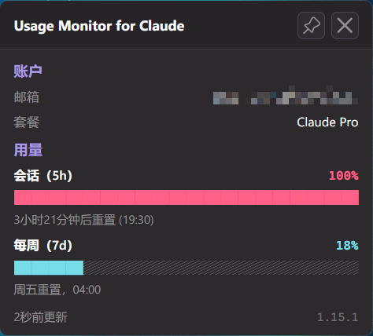

# CCMonitor

**简体中文** | [English](README_en-US.md) 

[](https://github.com/AlphaBrock/CCMonitor/discussions/categories/ideas)

**实时监控 Claude 与 Codex 用量 - 直接在 Windows 系统托盘和桌面面板中查看。**

CCMonitor 是一款原生 Windows 托盘应用，让您一目了然地掌握 Claude 和 Codex 用量 - 轻量、免安装、代码完全可审计。Claude 速率限制在 claude.ai、Claude Code、Claude Code Cowork 以及 VS Code 和 JetBrains IDE 扩展之间共享；Codex 用量通过本机 ChatGPT/Codex OAuth 会话读取。托盘、桌面面板、提醒和事件命令帮助您随时了解会话和周限额剩余量。



## 功能特性

- **免安装** - 单个 EXE 文件（约 9.8 MB），无需安装、无 Electron、无额外运行时依赖。下载后放在任意位置即可运行，卸载只需删除文件
- **零配置** - 默认以现有 Claude Code 登录作为托盘和提醒的主数据源；如本机已登录 Codex，桌面面板会同时显示 Codex 用量，用量查询无需 API 密钥
- **实时托盘图标** 带两个[可配置](docs/configuration.md#tray-icon-bars)进度条（默认显示会话和周用量），[可配置工具提示](docs/configuration.md#tooltip-fields)、百分比显示，可通过右键菜单选择托盘显示哪个 provider 的指标（Auto 悬停提示同时显示 Codex 和 Claude，图标进度条仍使用主 provider），以及适配浅色和深色任务栏的主题感知颜色
- **桌面面板** - 启动时可见显示，保持打开直到隐藏，支持左键拖拽定位，可置顶固定。默认直接在主面板显示当前 provider 选择下的 `5h` 用量，点击信息按钮后查看 `5h` / `7d` 配额、本地 30 天成本与 Token 估算、重置倒计时以及数据过时指示器
- **智能提醒** - 按配额类型可配置阈值通知，时间感知模式仅在使用超过已过时间比例时才提醒。接近耗尽的配额刷新后发送重置通知
- **[事件命令](docs/event-commands.md)** - 在配额重置、使用达到阈值或应用启动时运行自定义 Shell 命令。可发送手机推送通知、恢复 AI 代理、自动开始新的 5 小时会话、播放提示音或触发任何自定义工作流
- **自动令牌刷新** - Claude 模式在 OAuth 会话过期时后台运行 `claude update`；Codex 模式直接刷新本地 ChatGPT OAuth 令牌
- **自适应轮询** - 活跃使用时加速轮询，电脑空闲或锁定时暂停，在配额即将重置时对齐轮询，速率限制错误时自动退避
- **13 种语言**（英语、德语、法语、西班牙语、葡萄牙语、意大利语、日语、韩语、印地语、印尼语、简体中文、繁体中文、乌克兰语）- 自动检测 Windows 显示语言，或通过右键菜单手动切换
- **[可自定义](docs/configuration.md)** - 可通过 JSON 设置文件覆盖轮询间隔、颜色、提醒阈值等

---

## 安全性与透明度

本工具会处理您的 Claude Code 或 Codex OAuth 令牌，因此您应当能够验证其安全性。代码库刻意设计为易于审计：

- **固定网络目标** - Claude 模式仅与 `api.anthropic.com` 通信；Codex 模式仅与 `auth.openai.com` 和 `chatgpt.com` 通信
- **凭据本地保存** - OAuth 令牌仅用于 HTTP Authorization 头，从不记录日志、存储到其他位置或传输给第三方
- **最小写入** - 应用不写入自身状态文件；Codex OAuth 刷新成功时只会写回 Codex 自己的 `auth.json`
- **无动态代码执行** - 不使用 `eval()`、`exec()`、`compile()` 或动态导入
- **无混淆** - 无编码字符串、无隐藏 URL、无压缩逻辑
- **模块化架构** - 小而专注的模块，安全关键代码（凭据、API 调用）隔离在 provider 模块中（[`api.py`](src/integrations/api.py)、[`codex_api.py`](src/integrations/codex_api.py)）
- **最小运行时依赖** - 仅使用少量知名依赖：[requests](https://pypi.org/project/requests/) 负责网络请求，[pywebview](https://pypi.org/project/pywebview/) 负责桌面面板；托盘图标和通知使用 Windows 原生 API 实现，不依赖 Pillow 或 pystray

---

## 系统要求

- **Windows 10 或 Windows 11**（64 位）
- **Claude 数据**：已安装并登录 [Claude Code](https://docs.anthropic.com/en/docs/claude-code)（CLI、VS Code 扩展或 JetBrains 插件均可）。应用读取 Claude Code 本地存储的 OAuth 令牌（`~/.claude/.credentials.json`）。如果设置了 `CLAUDE_CONFIG_DIR`，应用使用该目录。
- **Codex 数据**：应用读取 `%CODEX_HOME%\auth.json` 或 `~\.codex\auth.json` 中的 ChatGPT/Codex OAuth 令牌。`OPENAI_API_KEY` 不能用于查询 Codex 用量。`usage_provider` 决定提醒、事件命令和 Auto 图标进度条使用哪个 provider 作为主数据源，`tray_provider` 控制托盘显示和桌面面板 provider 过滤。

> [!TIP]
> Claude 令牌过期时，应用会自动运行 `claude update`；Codex 令牌超过 8 天会直接刷新 OAuth token。如果令牌完全缺失，应用会显示通知和 "!" 图标 - 登录对应工具后监控器会自动检测到。

---

## 快速开始

**无需安装 Python。** 下载最新的 [**CCMonitor.exe**](https://github.com/AlphaBrock/CCMonitor/releases/latest)，放在任意位置运行即可。要卸载，先在右键菜单中禁用「开机启动」（如已启用），然后删除文件。

---

## 使用方法

| 操作 | 说明 |
|---|---|
| **悬停**在托盘图标上 | 工具提示显示 5h 和 7d 用量百分比及重置时间 |
| **应用启动** | 桌面面板立即在托盘附近打开，默认显示单卡片 5h 用量 |
| **左键点击**托盘图标 | 显示桌面面板并置顶 |
| **信息按钮** | 在主面板 `5h` 简略视图和完整详情面板之间切换；详情面板顶部 provider 图标会同步托盘 Provider 设置 |
| **右键点击**托盘图标 | 右键菜单：显示窗口、Provider 显示选择、开机启动、语言切换、检查更新、测试事件命令、重新启动、GitHub 链接、退出 |
| **PIN** 按钮 | 保持桌面窗口始终置顶 |
| **X** 按钮或 **Escape** | 隐藏桌面窗口到托盘 |

### 托盘图标不可见？

Windows 可能默认隐藏新的托盘图标。要保持图标始终可见：

1. 右键点击**任务栏** -> **任务栏设置**
2. 展开**其他系统托盘图标**（Win 11）或**选择哪些图标显示在任务栏上**（Win 10）
3. 将 **CCMonitor** 切换为**开**

### 进度条说明

桌面窗口以固定宽度 `█░` 文字条渲染用量：

1. **蓝色**（`0-49%`）- 低用量
2. **绿色**（`50-79%`）- 中等用量
3. **橙色/红色**（`80-99%`）- 高用量
4. **深红色**（`100%+`）- 配额耗尽

每行还显示精确百分比和重置倒计时文字。

---

## 配置

所有设置开箱即用 - 无需配置文件。要自定义行为，创建 `usage-monitor-settings.json` 文件，只需包含要更改的键：

```json
{
  "usage_provider": "claude",
  "poll_interval": 180,
  "bar_fg": "#00cc66",
  "bar_fg_warn": "#ff6600"
}
```

应用在两个位置搜索此文件（首个匹配生效）：

1. **EXE 旁边**（或从源码运行时的项目根目录）
2. **`~/.claude/usage-monitor-settings.json`**（如设置了 `$CLAUDE_CONFIG_DIR` 则为 `$CLAUDE_CONFIG_DIR/usage-monitor-settings.json`）

应用从不创建或修改此文件。详见 [Configuration](docs/configuration.md) 了解所有可用设置（提醒阈值、轮询间隔、颜色、语言等）。

---

## 从源码构建

<details>
<summary>面向想要自行构建 EXE 的开发者</summary>

### 前提条件

- Python 3.10+
- pip

### 设置

```bash
git clone https://github.com/AlphaBrock/CCMonitor.git
cd CCMonitor
python -m venv .venv
.venv\Scripts\activate
pip install -r requirements.txt
```

### 运行

```bash
python main.py
```

也可以使用包入口：

```bash
python -m src
```

### 构建 EXE

```bash
python scripts/build.py
```

生成 `dist/CCMonitor.exe`（约 9.8 MB），单文件可执行程序包含 Python 和所有依赖。

### 桌面窗口 UI 开发

桌面窗口 UI 位于 [`src/ui/popup/`](src/ui/popup/) 目录，包含独立的 HTML、CSS 和 JS 文件。要在不运行完整应用的情况下预览和迭代 UI：

```bash
start http://localhost:8080/dev.html && python -m http.server 8080 -d src/ui/popup
```

这会启动本地服务器并在默认浏览器中打开开发预览。使用按钮在数据预设（完整、最小、错误、加载中）之间切换，即时查看 CSS/JS 修改效果。

### 创建发布版本

1. 更新依赖：`pip install --upgrade -r requirements.txt`
2. 更新 [`src/__init__.py`](src/__init__.py) 中的 `__version__` 和 [`packaging/version_info.py`](packaging/version_info.py) 中的版本号（`filevers`、`prodvers`、`FileVersion`、`ProductVersion`）
3. 更新 [`src/integrations/api.py`](src/integrations/api.py) 中的 `_FALLBACK_USER_AGENT` 为当前 Claude Code 版本
4. 在 [`CHANGELOG.md`](CHANGELOG.md) 中将 `## [Unreleased]` 重命名为 `## [1.x.x] - YYYY-MM-DD`，并在其上方添加新的空 `## [Unreleased]` 段落
5. 运行测试套件：`python -m unittest discover -s tests`
6. 冒烟测试：`python -m src` - 验证托盘图标、桌面窗口和设置
7. 使用 `python scripts/build.py` 构建 EXE
8. 冒烟测试：`dist\CCMonitor.exe` - 验证托盘图标、桌面窗口和设置
9. 暂存步骤 2 到 4 的更改
10. 提交并推送发布准备
11. 创建并推送语义化标签（`X.Y.Z`）以触发发布工作流：

   ```bash
   git commit -m "Release 1.x.x"
   git push origin main
   git tag 1.x.x
   git push origin 1.x.x
   ```

GitHub Actions 工作流 [`.github/workflows/release.yml`](.github/workflows/release.yml) 会运行测试、构建 EXE、提取对应的 `CHANGELOG.md` 内容并自动发布 GitHub Release。

</details>

---

## 贡献

欢迎贡献 - 无论是 Bug 报告、功能建议还是 Pull Request。[提交 Issue](https://github.com/AlphaBrock/CCMonitor/issues) 报告 Bug 或提问。功能建议请浏览并投票已有提案或在 [Ideas](https://github.com/AlphaBrock/CCMonitor/discussions/categories/ideas) 提交新想法。

<details>
<summary>面向想要参与项目的开发者</summary>

本项目面向 Claude Code 与 Codex 的本机用量监控场景开发。[`.claude/CLAUDE.md`](.claude/CLAUDE.md) 文件包含所有项目规范、编码标准和架构指南。

### 工作流程

1. 阅读 `.claude/CLAUDE.md` 了解项目规范
2. 按照现有模块边界实现更改，保持凭据、API、托盘和 UI 逻辑可审计
3. 提交前运行 `/review` 斜杠命令，对所有暂存更改进行系统化质量审查（代码、测试、文档）
4. 如有修复则暂存，然后运行 `/commit-message` 生成格式规范的提交信息

### 添加功能

新功能应遵循现有架构。指南要点：

- 安全关键代码（凭据、API 调用）隔离在 [`api.py`](src/integrations/api.py) 和 provider 模块中
- 所有面向用户的更改需要更新 [`CHANGELOG.md`](CHANGELOG.md)、[`README.md`](README.md) 和 [`docs/configuration.md`](docs/configuration.md)（如适用）
- 测试是必需的 - 提交前运行 `python -m unittest discover -s tests`
- 应用不写入自身状态文件；Codex OAuth 刷新成功时只会写回 Codex 自己的 `auth.json`

</details>

---

## 许可证

MIT

---

## 免责声明

这是一个独立的社区项目。它**不是**由 [Anthropic](https://www.anthropic.com/) 或 [OpenAI](https://openai.com/) 创建、认可或官方支持的。"Claude" 和 "Anthropic" 是 Anthropic, PBC 的商标；"OpenAI"、"ChatGPT" 和 "Codex" 是 OpenAI 的商标。使用这些名称仅用于描述性目的以表明兼容性。
