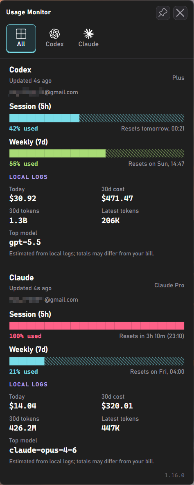

# CCMonitor

**English** | [简体中文](README.md)

[](https://github.com/AlphaBrock/CCMonitor/discussions/categories/ideas)

**Monitor Claude and Codex usage in real time - right from your Windows tray and desktop panel.**

CCMonitor is a native Windows tray app that shows Claude and Codex usage at a glance - lightweight, portable, and fully auditable. Claude rate limits are shared across claude.ai, Claude Code, Claude Code Cowork, and IDE extensions for VS Code and JetBrains; Codex usage is read from the local ChatGPT/Codex OAuth session. The tray icon, desktop panel, alerts, and event commands help you track session and weekly quota before you run out.



## Features

- **Portable** - single EXE (~9.8 MB), no installation, no Electron, no extra runtime required. Download, place anywhere, run. To uninstall, delete the file
- **Zero configuration** - defaults to your existing Claude Code login for tray alerts and commands; if Codex is logged in locally, the detail window shows Codex usage too, and usage queries do not use API keys
- **Live tray icon** with two [configurable](docs/configuration.md#tray-icon-bars) progress bars (session + weekly by default), [configurable tooltip](docs/configuration.md#tooltip-fields), percentage display, a right-click menu to choose which provider the tray shows (Auto shows Codex and Claude in the hover tooltip while icon bars use the primary provider), and theme-aware colors for light and dark taskbars
- **Desktop detail window** - launches visible on startup, stays open until you hide it, supports left-drag repositioning, and can be pinned above other windows. The window provides All / Codex / Claude views with both providers' `5h` / `7d` quotas, local 30-day cost and token estimates, reset countdowns, and stale-data indicators
- **Smart alerts** - configurable threshold notifications per quota type, with time-aware mode that only alerts when usage outpaces elapsed time. Reset notifications when a nearly exhausted quota refills
- **[Event commands](docs/event-commands.md)** - run a custom shell command when a quota resets, a usage threshold is crossed, or the app starts up. Send push notifications to your phone, resume an AI agent, start a fresh 5-hour session automatically, play an alert sound, or trigger any custom workflow
- **Automatic token refresh** - Claude mode runs `claude update` when the OAuth session expires; Codex mode refreshes the local ChatGPT OAuth token directly
- **Adaptive polling** - speeds up during active usage, pauses when the computer is idle or locked, aligns to imminent quota resets, and backs off on rate-limit errors
- **13 languages** (English, German, French, Spanish, Portuguese, Italian, Japanese, Korean, Hindi, Indonesian, Chinese Simplified, Chinese Traditional, Ukrainian) - auto-detected from your Windows display language, with optional manual override via the `language` setting
- **[Customizable](docs/configuration.md)** - optionally override polling intervals, colors, alert thresholds, and more via a JSON settings file

---

## Security & Transparency

This tool handles your Claude Code or Codex OAuth token, so you should be able to verify it is safe. The codebase is deliberately structured for easy auditing:

- **Fixed network destinations** - Claude mode communicates only with `api.anthropic.com`; Codex mode communicates only with `auth.openai.com` and `chatgpt.com`
- **Credentials stay local** - the OAuth token is used only in HTTP Authorization headers, never logged, stored elsewhere, or transmitted to third parties
- **Minimal writes** - the app does not write its own state files; after a successful Codex OAuth refresh, it writes the refreshed token back to Codex's own `auth.json`
- **No dynamic code execution** - no `eval()`, `exec()`, `compile()`, or dynamic imports
- **No obfuscation** - no encoded strings, no hidden URLs, no minified logic
- **Modular architecture** - small, focused modules with security-critical code (credentials, API calls) isolated in provider modules ([`api.py`](src/integrations/api.py), [`codex_api.py`](src/integrations/codex_api.py))
- **Minimal runtime dependencies** - only a few well-known dependencies: [requests](https://pypi.org/project/requests/) for network calls and [pywebview](https://pypi.org/project/pywebview/) for the desktop panel; tray icons and notifications use native Windows APIs without Pillow or pystray

---

## Requirements

- **Windows 10 or Windows 11** (64-bit)
- **Claude data**: [Claude Code](https://docs.anthropic.com/en/docs/claude-code) installed and logged in (CLI, VS Code extension, or JetBrains plugin - any variant works). The app reads the OAuth token that Claude Code stores locally (`~/.claude/.credentials.json`). If you have `CLAUDE_CONFIG_DIR` set, the app uses that directory instead.
- **Codex data**: the app reads ChatGPT/Codex OAuth tokens from `%CODEX_HOME%\auth.json` or `~\.codex\auth.json`. `OPENAI_API_KEY` cannot query Codex usage. `usage_provider` chooses the primary provider for alerts, event commands, and Auto icon bars; `tray_provider` controls tray display separately.

> [!TIP]
> Claude token expiry runs `claude update`; Codex tokens older than 8 days are refreshed directly through OAuth. If the token is missing entirely, the app shows a notification and a "!" icon - log in to the selected tool and the monitor picks it up automatically.

---

## Quick Start

**No Python required.** Download the latest [**CCMonitor.exe**](https://github.com/AlphaBrock/CCMonitor/releases/latest), place it wherever you like, and run it. To remove, disable "Start with Windows" in the context menu first (if enabled), then delete the file.

---

## How to Use

| Action | What happens |
|---|---|
| **Hover** over the tray icon | Tooltip shows 5h and 7d usage percentages with reset times |
| **App start** | The desktop detail window opens immediately near the tray |
| **Left-click** the tray icon | Shows the desktop detail window and brings it to the front |
| **All / Codex / Claude** | Switches between combined and provider-specific detail views |
| **Right-click** the tray icon | Context menu: show window, provider display selector, autostart toggle, test event commands, restart, GitHub link, or quit |
| **PIN** button | Keeps the desktop window always on top |
| **X** button or **Escape** | Hides the desktop window to the tray |

### Tray icon not visible?

Windows may hide new tray icons by default. To keep the icon always visible:

1. Right-click the **taskbar** → **Taskbar settings**
2. Expand **Other system tray icons** (Win 11) or **Select which icons appear on the taskbar** (Win 10)
3. Toggle **CCMonitor** to **On**

### Reading the progress bars

The desktop window renders usage as fixed-width `█░` text bars:

1. **Blue** (`0-49%`) - low usage
2. **Green** (`50-79%`) - moderate usage
3. **Orange/red** (`80-99%`) - high usage
4. **Strong red** (`100%+`) - exhausted quota

Each row also shows the exact percentage and reset countdown text.

---

## Configuration

All settings work out of the box - no configuration file is needed. To customize behavior, create a file called `usage-monitor-settings.json` with only the keys you want to change:

```json
{
  "usage_provider": "claude",
  "poll_interval": 180,
  "bar_fg": "#00cc66",
  "bar_fg_warn": "#ff6600"
}
```

The app searches for this file in two locations (first match wins):

1. **Next to the EXE** (or project root when running from source)
2. **`~/.claude/usage-monitor-settings.json`** (or `$CLAUDE_CONFIG_DIR/usage-monitor-settings.json` if set)

The app never creates or modifies this file. See [Configuration](docs/configuration.md) for all available settings (alert thresholds, polling intervals, colors, language, and more).

---

## Building from Source

<details>
<summary>For developers who want to build the EXE themselves</summary>

### Prerequisites

- Python 3.10+
- pip

### Setup

```bash
git clone https://github.com/AlphaBrock/CCMonitor.git
cd CCMonitor
python -m venv .venv
.venv\Scripts\activate
pip install -r requirements.txt
```

### Run

```bash
python main.py
```

If you prefer the package entry directly, this still works too:

```bash
python -m src
```

### Build EXE

```bash
python scripts/build.py
```

Produces `dist/CCMonitor.exe` (~9.8 MB), a single-file executable that bundles Python and all dependencies.

### Desktop Window UI Development

The desktop window UI lives in [`src/ui/popup/`](src/ui/popup/) as separate HTML, CSS, and JS files. To preview and iterate on the UI without running the full app:

```bash
start http://localhost:8080/dev.html && python -m http.server 8080 -d src/ui/popup
```

This starts a local server and opens the dev preview in your default browser. Use the buttons to switch between data presets (full, minimal, error, loading) and test CSS/JS changes with instant feedback.

### Create a Release

1. Update dependencies: `pip install --upgrade -r requirements.txt`
2. Update `__version__` in [`src/__init__.py`](src/__init__.py) and the version in [`packaging/version_info.py`](packaging/version_info.py) (`filevers`, `prodvers`, `FileVersion`, `ProductVersion`)
3. Update `_FALLBACK_USER_AGENT` in [`src/integrations/api.py`](src/integrations/api.py) to the current Claude Code version
4. In [`CHANGELOG.md`](CHANGELOG.md), rename `## [Unreleased]` to `## [1.x.x] - YYYY-MM-DD` and add a fresh empty `## [Unreleased]` section above it
5. Run the test suite: `python -m unittest discover -s tests`
6. Smoke test: `python -m src` - verify tray icon, desktop window, and settings
7. Build the EXE with `python scripts/build.py`
8. Smoke test: `dist\CCMonitor.exe` - verify tray icon, desktop window, and settings
9. Stage the changes from steps 2 to 4
10. Commit and push the release prep.
11. Create and push a plain semantic tag (`X.Y.Z`) to trigger the release workflow:

   ```bash
   git commit -m "Release 1.x.x"
   git push origin main
   git tag 1.x.x
   git push origin 1.x.x
   ```

The GitHub Actions workflow in [`.github/workflows/release.yml`](.github/workflows/release.yml) runs the tests, builds the EXE, extracts the matching `CHANGELOG.md` section, and publishes the GitHub release automatically.

</details>

---

## Contributing

Contributions are welcome - whether it's bug reports, feature ideas, or pull requests. [Open an issue](https://github.com/AlphaBrock/CCMonitor/issues) to report bugs or ask questions. For feature ideas, browse and vote on existing proposals or submit your own in [Ideas](https://github.com/AlphaBrock/CCMonitor/discussions/categories/ideas).

<details>
<summary>For developers who want to contribute to the project</summary>

This project is built for local Claude Code and Codex usage monitoring. The [`.claude/CLAUDE.md`](.claude/CLAUDE.md) file contains the project conventions, coding standards, and architectural guidelines.

### Workflow

1. Read `.claude/CLAUDE.md` to understand the project conventions
2. Implement changes within the existing module boundaries so credential, API, tray, and UI logic remain auditable
3. Before committing, run the `/review` slash command to perform a systematic quality review of all staged changes (code, tests, documentation)
4. Stage remaining fixes if any, then run `/commit-message` to generate a properly formatted commit message

### Adding features

New features should follow the existing architecture. Key points from the guidelines:

- Security-critical code (credentials, API calls) stays isolated in [`api.py`](src/integrations/api.py) and provider modules
- All user-facing changes need updates in [`CHANGELOG.md`](CHANGELOG.md), [`README.md`](README.md), and [`docs/configuration.md`](docs/configuration.md) where applicable
- Tests are required - run `python -m unittest discover -s tests` before committing
- The app does not write its own state files; after a successful Codex OAuth refresh, it writes only Codex's own `auth.json`

</details>

---

## License

MIT

---

## Disclaimer

This is an independent, community-built project. It is **not** created, endorsed, or officially supported by [Anthropic](https://www.anthropic.com/) or [OpenAI](https://openai.com/). "Claude" and "Anthropic" are trademarks of Anthropic, PBC; "OpenAI", "ChatGPT", and "Codex" are trademarks of OpenAI. Use of these names is solely for descriptive purposes to indicate compatibility.
